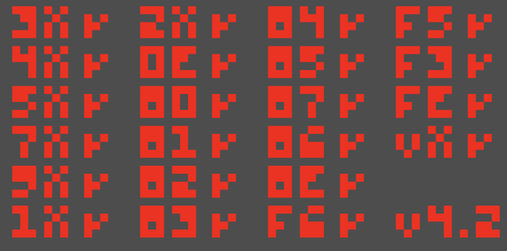
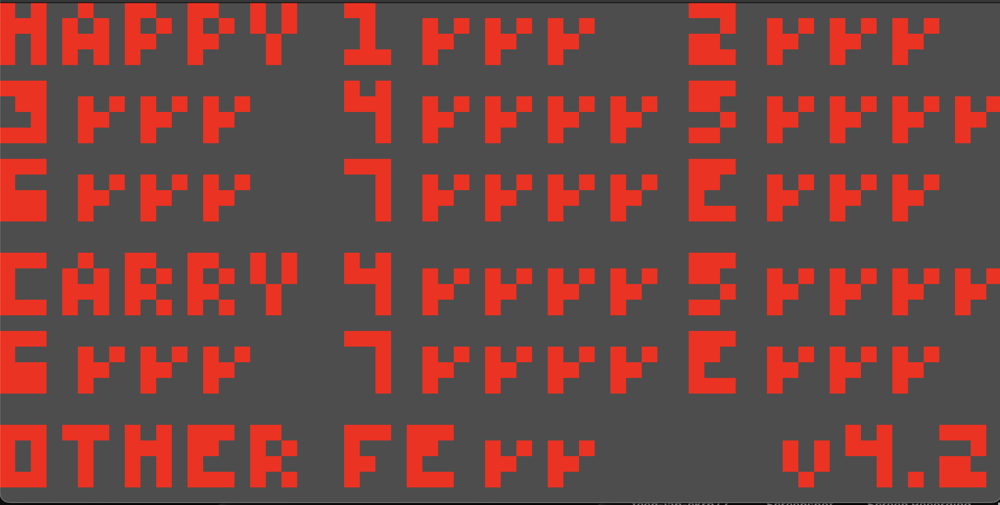

## CHIP-8 Emulator
This is a really simple implementation of a Chip-8 Emulator / Interpreter. This is just a project to start learning rust so don't expect anything too crazy in terms of the rust usage. 

Most basic Chip-8 features are implemented. Nearly all the instructions are correctly being interpreted as shown by the various tests roms.

To run the emulator, just do cargo run test-path (i.e. cargo run ./1-chip8-logo.ch8).

The descriptions of the instructions that I used to implement them can be found [here](http://devernay.free.fr/hacks/chip8/C8TECH10.HTM#3.1).

The github where I got the tests from is [here](https://github.com/Timendus/chip8-test-suite?tab=readme-ov-file#ibm-logo).

## Screenshots

